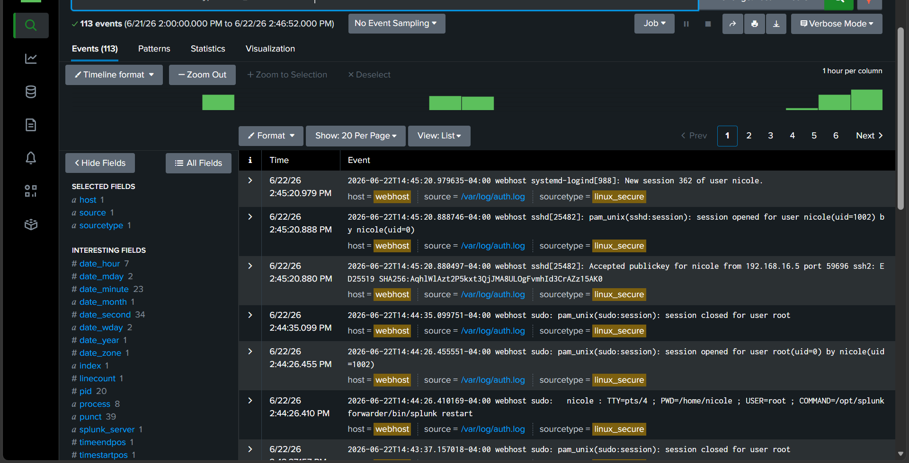
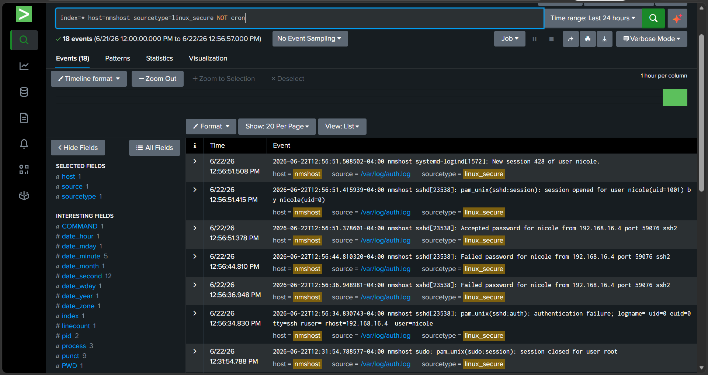
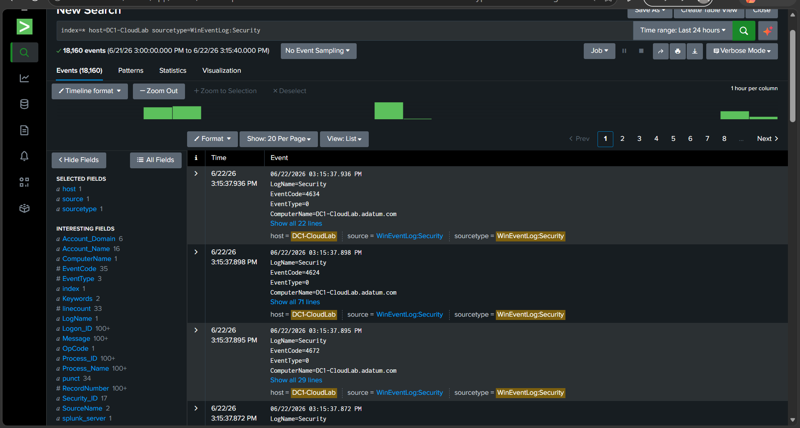
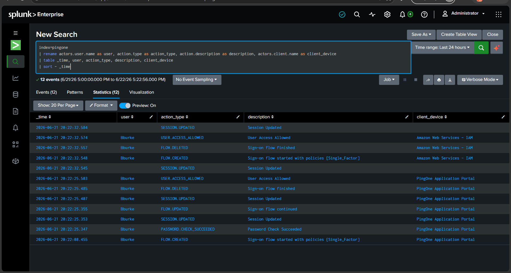
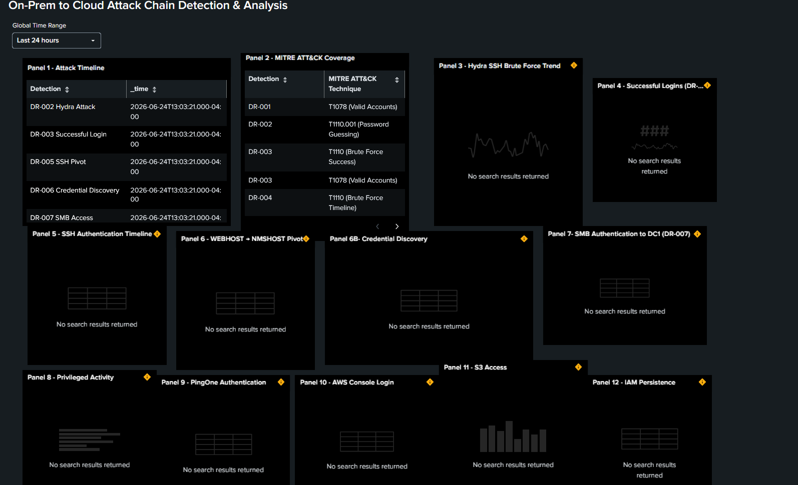

Before simulating the attack chain, I verified that all systems were forwarding logs to Splunk and that the environment was operating normally.

The screenshots in this folder demonstrate:

- Normal activity from WebHost
- Normal activity from NMSHost
- Normal activity from DC1
- Normal activity from PingOne
- Normal activity from AWS
- Successful log ingestion from all configured sources
- Initial dashboard state before attack execution
- 
Establishing this baseline ensured that all telemetry sources were functioning correctly before attack simulation and detection testing.
---

### 🖼️ Baseline Telemetry Evidence

#### WebHost Baseline

#### NMSHost Baseline

#### DC1 Baseline

#### PingOne Baseline

#### AWS Baseline

#### Splunk Log Ingestion Validation

#### Pre-Attack Dashboard State

