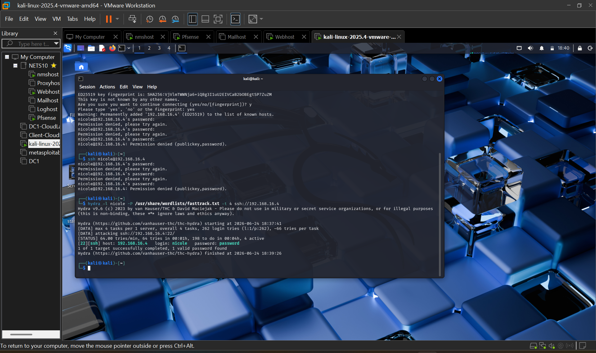
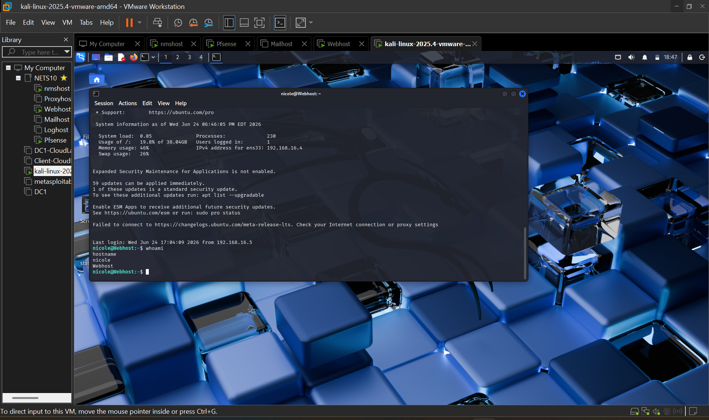
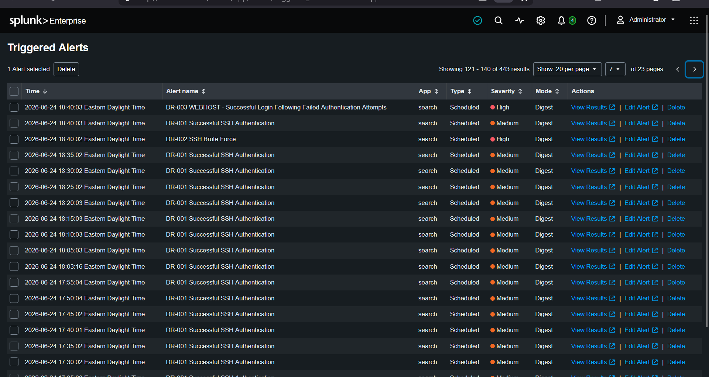
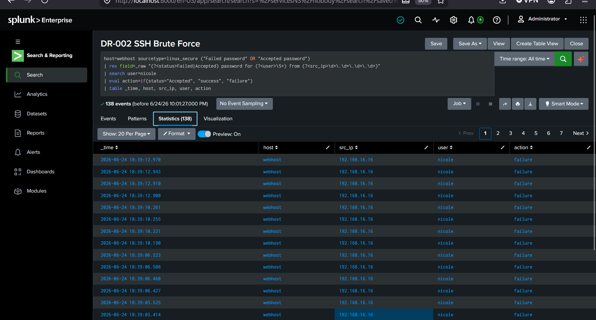
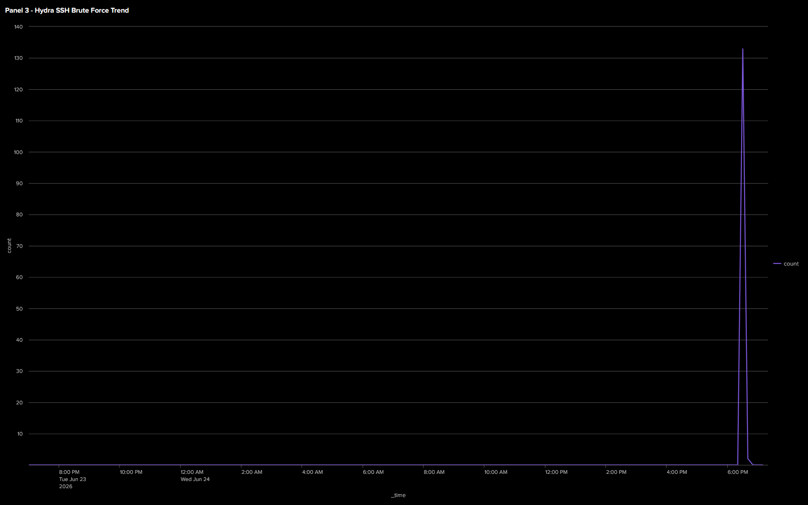

# Phase 1 - Initial Access (SSH Brute Force)

## Objective
The objective of this phase was to simulate an external attacker gaining initial access to the WebHost through SSH brute force techniques.

## Attack Summary
Kali Linux was used to perform a brute force attack against the SSH service on the WebHost. After multiple failed login attempts, valid credentials were successfully discovered and an SSH session was established.

## Detection 
Splunk identified repeated failed SSH authentication attempts followed by a successful login from the same source IP, indicating potential brute force activity.

## Detection Rules

### DR-002 – SSH Brute Force

**Objective:** Detect repeated failed SSH login attempts.

```spl
host=webhost sourcetype=linux_secure
"Failed password"
| rex field=_raw "Failed password for (?<user>\S+) from (?<src_ip>\d+\.\d+\.\d+\.\d+)"
| stats count by host user src_ip
| where count >= 5
```

**Result:** ✅ Alert triggered after five failed SSH login attempts.

---

### DR-003 – Successful Login After Brute Force

**Objective:** Detect a successful SSH login following multiple failed attempts.

```spl
host=webhost sourcetype=linux_secure
("Failed password" OR "Accepted password")
| rex field=_raw "(Failed|Accepted) password for (?<user>\S+) from (?<src_ip>\d+\.\d+\.\d+\.\d+)"
| eval action=if(searchmatch("Accepted password"),"success","failure")
| stats count(eval(action="failure")) as failures
        count(eval(action="success")) as successes
        by host user src_ip
| where failures>=5 AND successes>=1
```

**Result:** ✅ Alert triggered when a successful login followed multiple failed attempts.

## Investigation
The activity was investigated using Splunk search queries across Linux authentication logs. The logs confirmed:

- High volume of failed SSH login attempts
- A successful authentication following the failures
- Session initiation from the same source IP

This pattern is consistent with brute force credential guessing.

## MITRE ATT&CK Mapping

| Technique | ID | Description |
|------------|-----|-------------|
| Brute Force | T1110 | Repeated login attempts against SSH |

## Evidence
Screenshots in this folder show:

- **Hydra Terminal Success:**


- **Hydra Successful Credentials:**


- **DR-003 Alert Trigger History:**


- **DR-003 Investigation Result:**


- **Dashboard Update:**



## Outcome
Initial access to the WebHost was successfully achieved and confirmed through log analysis in Splunk.
