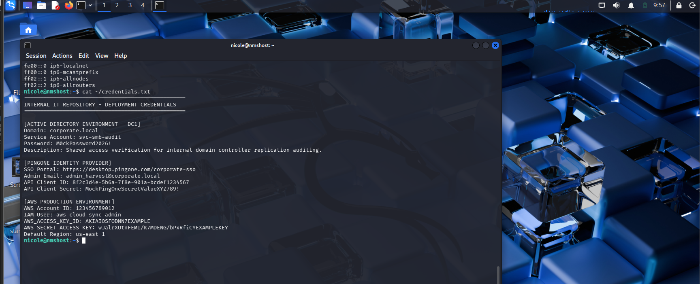
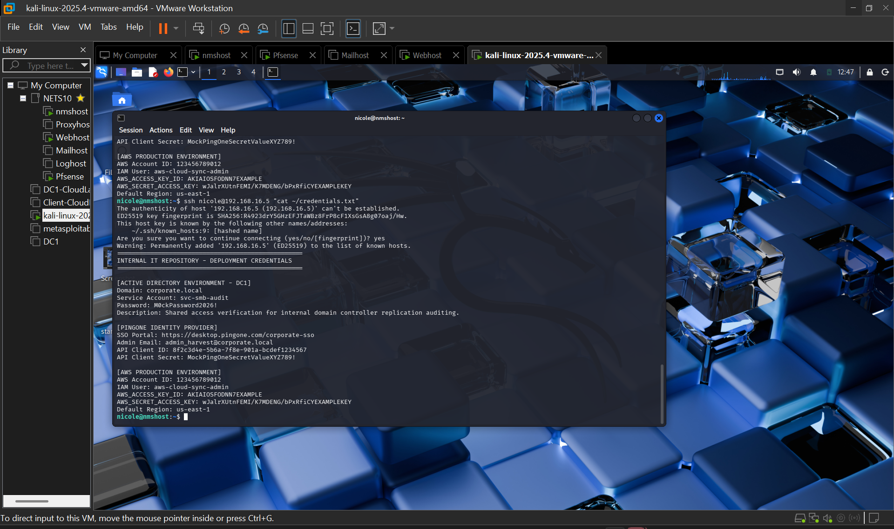
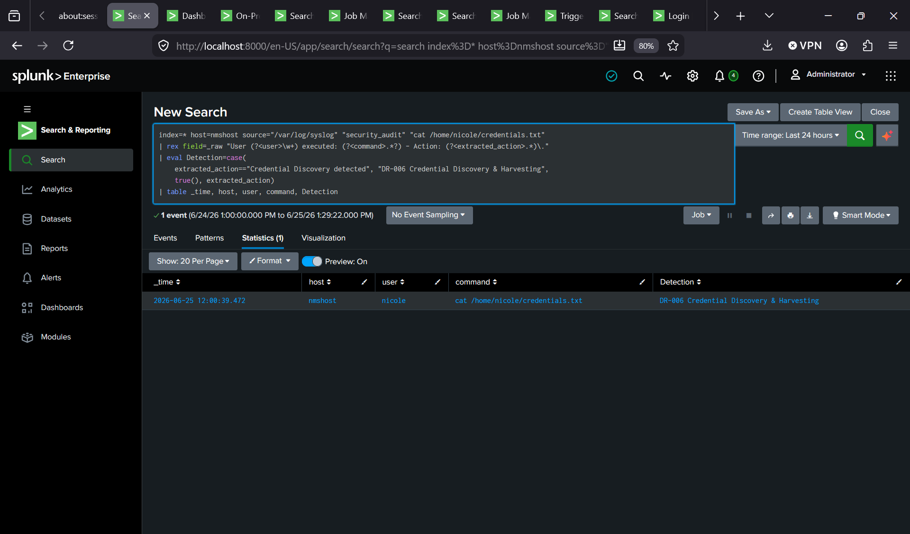
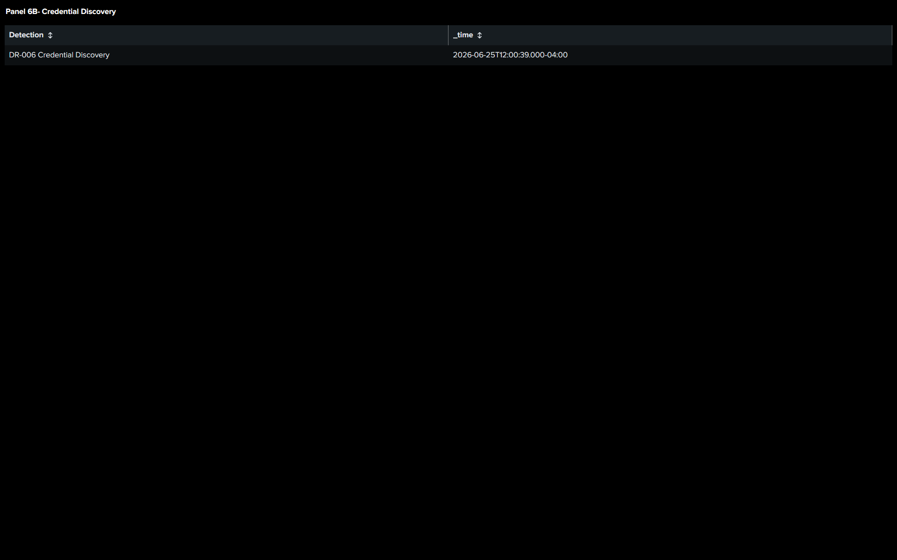

# Phase 2 – Lateral Movement & Credential Harvesting

## Objective

After gaining initial access to the WebHost, the objective of this phase was to pivot into the internal network by establishing an SSH session to the NMSHost. Once access was obtained, the system was examined for sensitive information that could be used to compromise additional on-premises and cloud resources.

## Attack Summary

Using valid credentials obtained during the initial access phase, an internal SSH connection was established from the compromised WebHost to the NMSHost. During post-compromise enumeration, administrative credentials for Active Directory, PingOne, and AWS were discovered in a plaintext file. These credentials were harvested and later used during the identity and cloud compromise phases of the attack.

## Investigation

This phase did had a dedicated detection rule but activity was investigated using Splunk searches against Linux authentication and system logs.

The investigation confirmed:

- Successful internal SSH authentication from the WebHost to the NMSHost.
- Interactive access to the NMSHost.
- Timeline correlation between the internal pivot and credential harvesting activity.
- Visibility of the attacker activity through the updated Splunk dashboard.

Because the credentials were stored locally in a plaintext file, the credential discovery itself did not generate a specific log event. The investigation relied on correlating authentication activity with the observed attacker actions.

## MITRE ATT&CK Mapping

| Technique            | ATT&CK ID | Description |
|----------------------|-----------|-------------|
| Remote Services: SSH | T1021.004 | Internal SSH pivot from the compromised WebHost to the NMSHost. |
| Valid Accounts       | T1078     | Legitimate credentials were used to authenticate to the NMSHost. |
| Unsecured Credentials| T1552.001 | Plaintext credentials for Active Directory, PingOne, and AWS were discovered and harvested from a local file. |

## Evidence

- **Nmshost Pivot Success:**

- **Credential Discovery:**

- **Credential Harvesting:**

- **DR-006 Investigation:**

- **Dashboard Update:**

## Outcome

The attacker successfully pivoted from the compromised WebHost into the internal network and accessed the NMSHost using valid credentials. Administrative credentials for Active Directory, PingOne, and AWS were harvested from a plaintext file, enabling the next stages of the attack chain involving identity compromise and cloud access.
