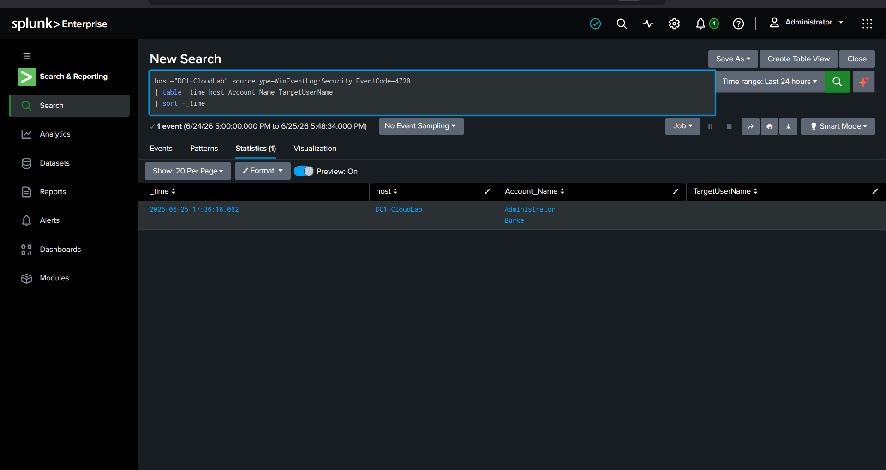
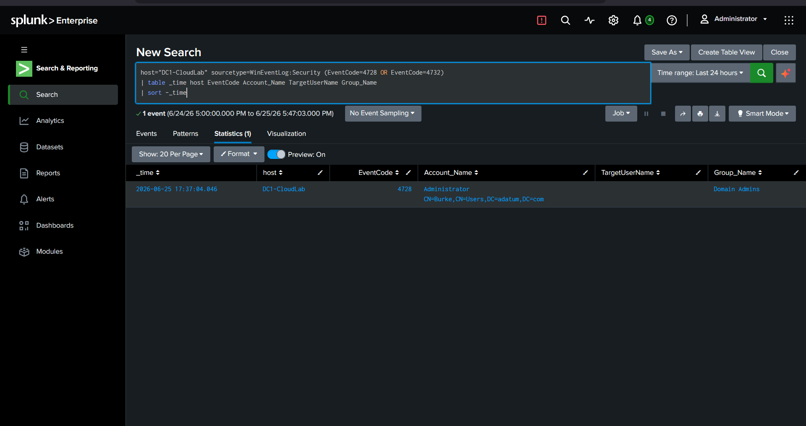
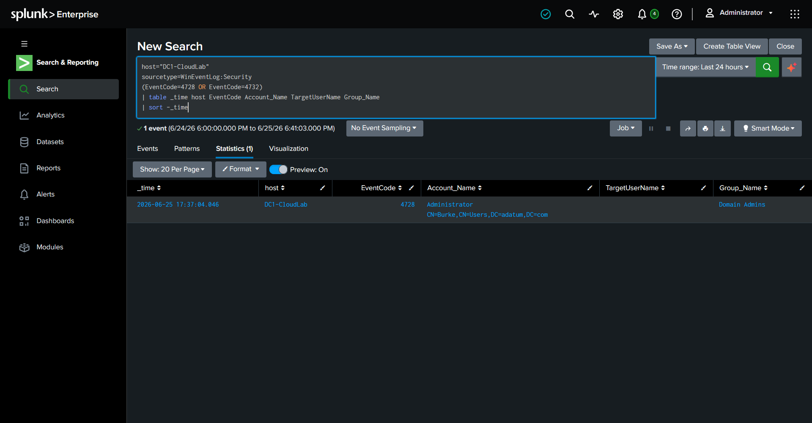
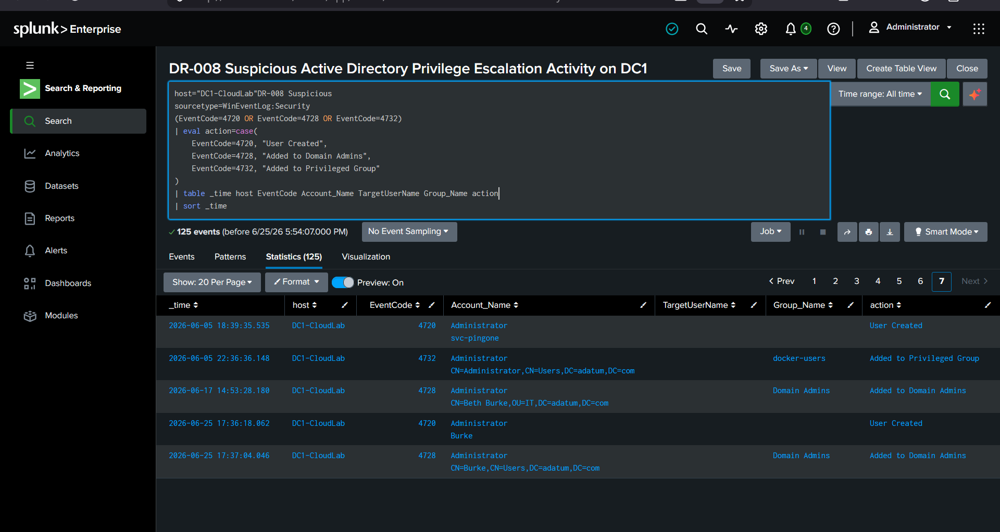
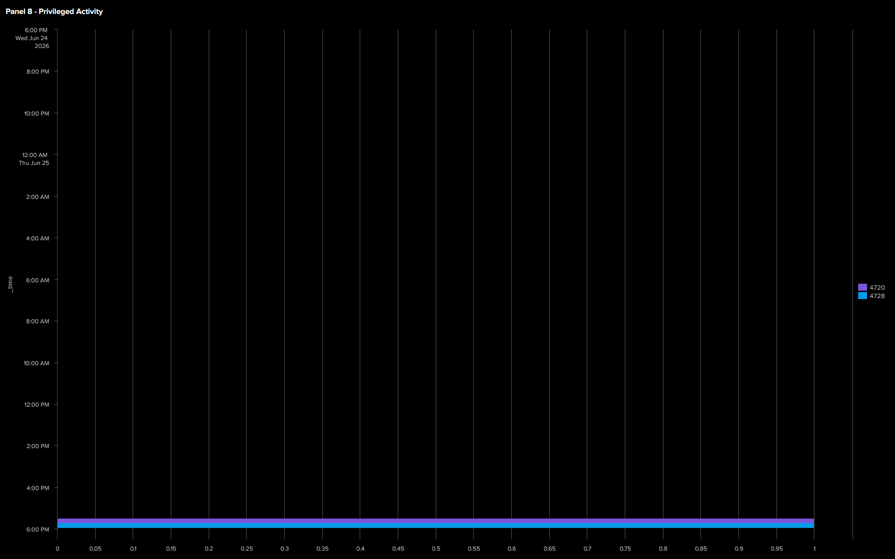

# Phase 3 – Active Directory Compromise & Persistence

## Objective

The objective of this phase was to use the administrative credentials harvested from the NMSHost to authenticate to the Domain Controller (DC1), establish persistence by creating a new domain user account, elevate its privileges by adding it to the **Domain Admins** group, and validate that the resulting Windows Security Events were successfully ingested into Splunk.

## Attack Summary

Administrative credentials harvested during the previous phase were used to authenticate directly to the Domain Controller (DC1). After successfully logging in, a new domain user account was created and added to the **Domain Admins** group, establishing privileged persistence within the Active Directory environment.

This activity generated Windows Security Events that were forwarded to Splunk, allowing the attack to be investigated and correlated throughout the attack timeline.

## Detection Rules

### DR-007 – Active Directory Authentication Using Stolen Credentials

**Objective:** Detect successful Active Directory logons using compromised credentials from NMSHost.

```spl
host=DC1-CloudLab sourcetype=WinEventLog:Security EventCode=4624 Logon_Type=3
| eval match_user=coalesce(Account_Name, TargetUserName, SubjectUserName)
| search match_user="*Burke*"
| eval src_host=coalesce(IpAddress, Source_Network_Address)
| stats count by match_user src_host host Logon_Type
```

**Result:** Validated. Successful domain authentication was observed using the compromised "Burke" account.

### DR-008 – Active Directory Privilege Escalation Activity

**Objective:** Detect account creation and privilege escalation activity in Active Directory.

```spl
host=DC1-CloudLab sourcetype=WinEventLog:Security
(EventCode=4720 OR EventCode=4728 OR EventCode=4732)
| table _time EventCode Account_Name TargetUserName Group_Name
```

**Result:** Validated. Detected user creation and privilege escalation activity involving Domain Admin group modification.

## Investigation

Windows Security Event Logs were investigated in Splunk to validate the attacker activity performed on the Domain Controller.

The investigation confirmed:

- Successful authentication to the Domain Controller using valid administrative credentials.
- Creation of a new domain user account.
- Addition of the newly created account to the **Domain Admins** group.
- Successful ingestion of the corresponding Windows Security Events into Splunk.
- Visibility of the attack activity through the updated Splunk dashboard.

The collected events provided a clear audit trail of the persistence activity and validated that Active Directory telemetry was successfully monitored throughout the attack simulation.

### Observed Windows Security Events

The following key Event IDs were identified during analysis:

| Event ID | Description |
|----------|-------------|
| **4624** | Successful logon to the Domain Controller |
| **4720** | A new user account was created |
| **4728** | A member was added to a security-enabled global group (Domain Admins) |

These events provided a clear audit trail of account creation and privilege escalation activity within Active Directory.

## MITRE ATT&CK Mapping

|            Technique           |     ATT&CK ID      | Description |
|--------------------------------|--------------------|-------------|
| Valid Accounts                 |       **T1078**    | Administrative credentials were used to authenticate to the DC. |
| Create Account: Domain Account |     **T1136.002**  | A new domain user account was created to establish persistence. |
| Account Manipulation           |      **T1098**     | The newly created account was added to the Domain Admins group to obtain elevated privileges. |

---

## Evidence

- **AD User Creation:**


---

- **AD User Creation:**


- **Added to Domain Admins:**


- **Privileged Group Change:**


- **AD Investigation Timeline:**


- **Dashboard Updated:**


---

## Outcome

The attacker successfully authenticated to the Domain Controller using valid administrative credentials and established persistence by creating a privileged domain account. The resulting Windows Security Events were successfully collected, investigated, and visualized in Splunk, demonstrating effective monitoring of Active Directory account creation and privilege escalation activities.
