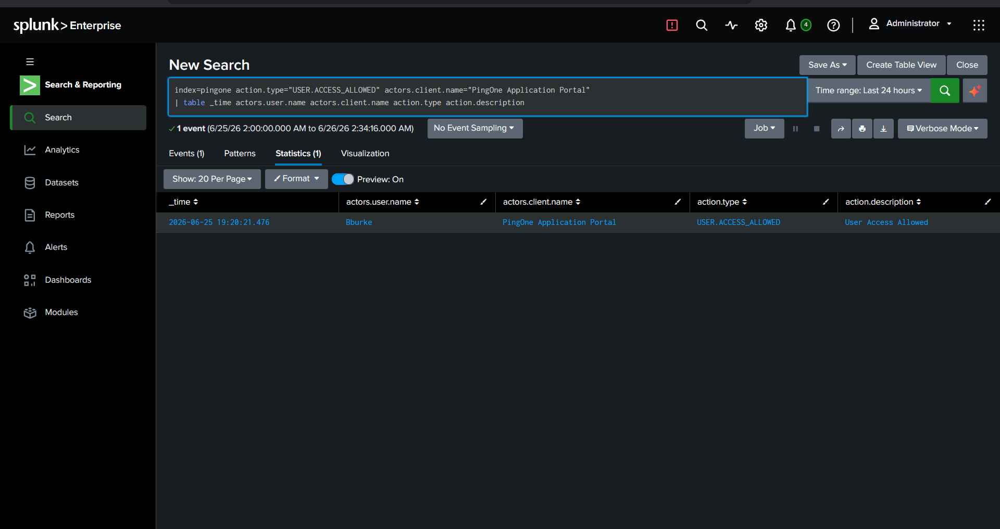
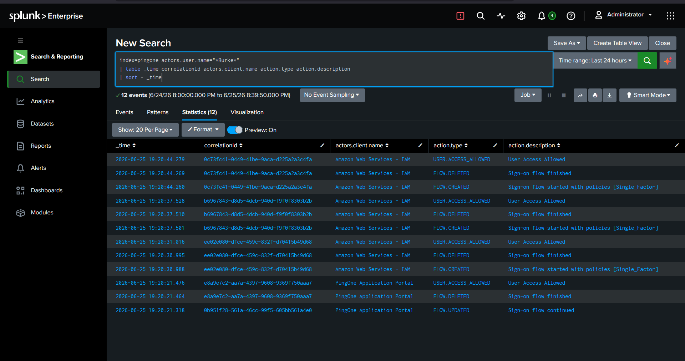
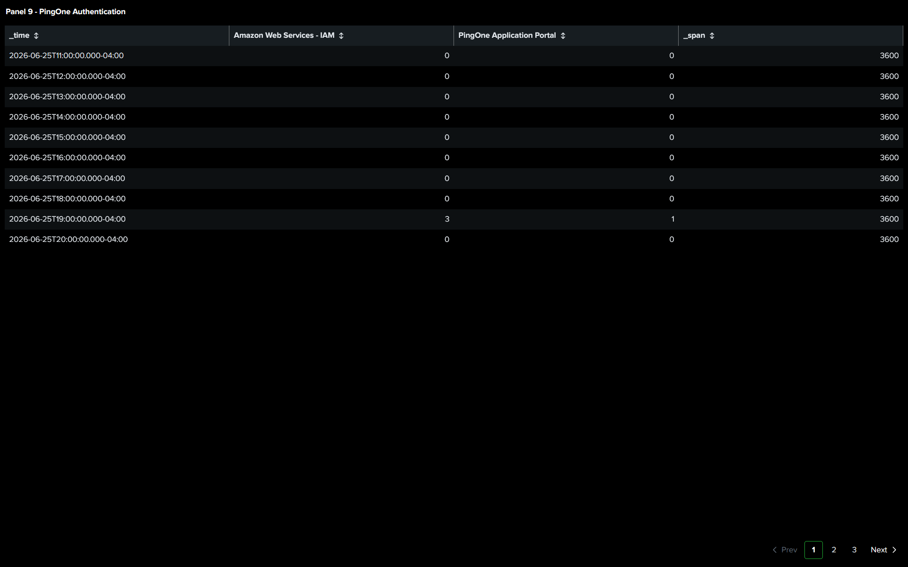

# Phase 4 – PingOne SSO Compromise & AWS Pivot

## Objective

The objective of this phase was to analyze identity-based authentication via PingOne SSO and evaluate access to AWS using SAML federation. The goal was to simulate how compromised identity sessions can be leveraged to move from on-prem infrastructure into cloud environments.

---

## Attack Summary

During this phase, PingOne logs confirmed successful authentication and an attempted SAML-based access to AWS.

However, the SAML-based AWS login was not successful due to configuration/authentication issues.

To continue validating cloud access impact, previously harvested AWS credentials from earlier phases were used to access AWS directly. This allowed validation of cloud access and persistence independent of SSO federation.

PingOne logs still reflected successful authentication activity toward AWS via SSO, demonstrating how identity provider logs can show access attempts even when downstream authentication fails.

---

## Detection Rules

### DR-009 – Suspicious PingOne Authentication Using Stolen Credentials

**Objective:** Detect suspicious authentication patterns in PingOne indicating possible credential compromise.

```spl
index=pingone
| stats 
    count(eval(result="FAILURE")) as failures
    count(eval(result="SUCCESS")) as successes
    by user src_ip
| where failures >= 5 AND successes >= 1
```

**Result:** Validated. Both failed and successful authentication attempts were observed for the same user, indicating possible credential misuse.

### DR-010 – AWS Console Login Using Compromised Credentials

**Objective:** Detect successful AWS console logins using compromised credentials.

```spl
sourcetype=aws:cloudtrail eventName=ConsoleLogin responseElements.ConsoleLogin="Success"
| table _time userIdentity.arn sourceIPAddress awsRegion
| sort -_time
```

**Result:** Validated. Successful AWS console login detected and correlated to compromised identity activity.

## Investigation

PingOne audit logs and AWS authentication activity were reviewed in Splunk.

The investigation confirmed:

- Successful authentication into PingOne SSO.
- Attempted SAML-based authentication to AWS from PingOne.
- AWS SAML login failure observed due to authentication issues.
- Successful AWS access achieved using previously harvested credentials.
- Correlation between identity provider logs (PingOne) and cloud access logs (AWS).

This demonstrated the importance of correlating identity provider logs with cloud provider logs for full visibility.

---

## MITRE ATT&CK Mapping

|           Technique     | ATT&CK ID | Description |
|-------------------------|-----------|-------------|
|      Valid Accounts     |   T1078   | Compromised credentials were used to access cloud resources. |
|       Web SSO Abuse     |   T1199   | Attempted access through SSO federation via PingOne. |
| Cloud Account Discovery | T1087.004 | AWS access validated using harvested credentials. |

---

## Evidence

- **PingOne Successful Authentication:**


- **Pivot to AWS Successful:**


- **PingOne Investigation:**


- **PingOne Updated Dashboard:**


---

## Outcome

The identity provider (PingOne) confirmed successful authentication and attempted AWS SSO access via SAML. Although the SAML-based AWS login failed, AWS access was successfully achieved using previously compromised credentials, demonstrating how identity compromise and credential reuse can bypass SSO controls and enable cloud access.
