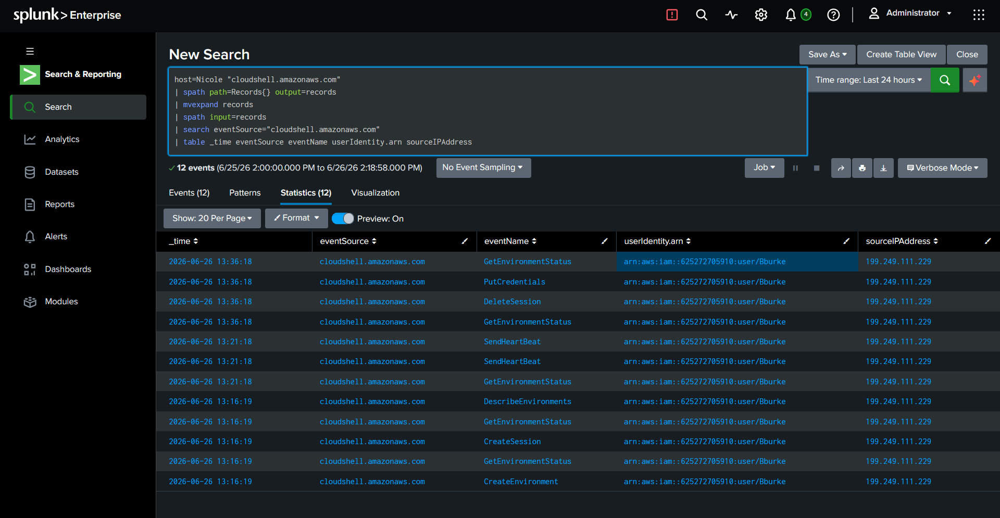
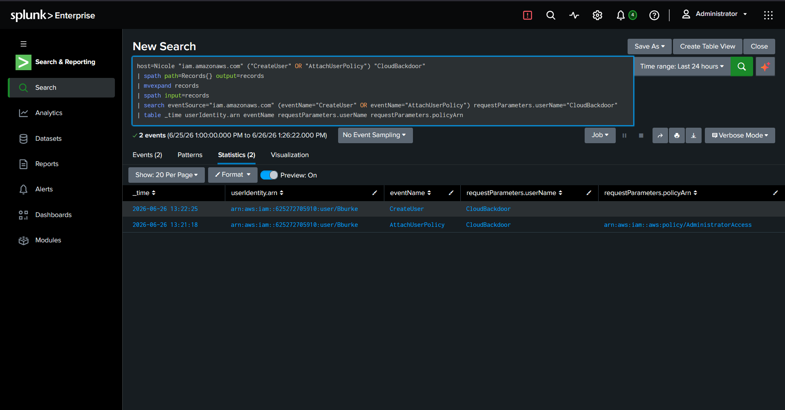
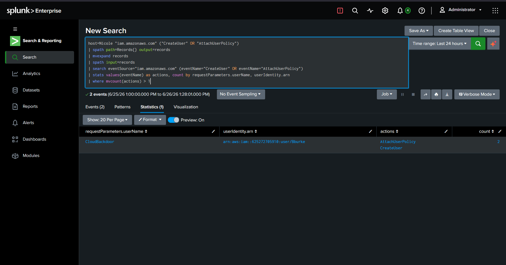
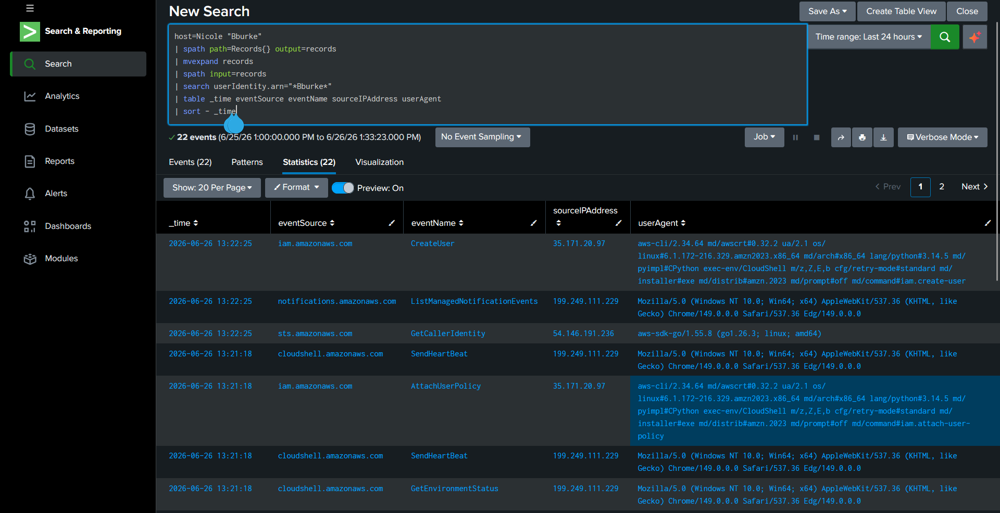
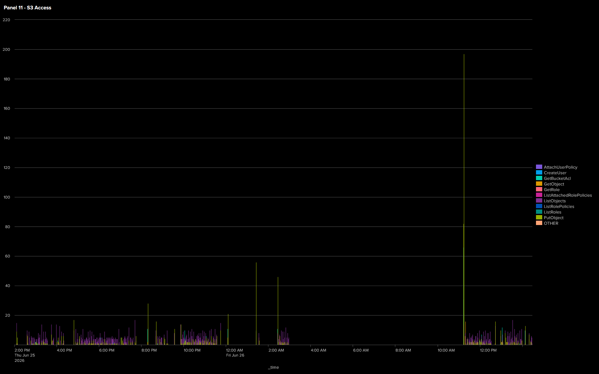

# Phase 5 – AWS S3 Exfiltration & Persistence

## Objective

The objective of this phase was to simulate cloud-level impact following identity and credential compromise from previous phases. This included accessing AWS, identifying sensitive data stored in S3, performing data exfiltration, and establishing persistence within the AWS environment.

---

## Attack Summary

Using previously compromised AWS credentials, access to the AWS environment was successfully established.

Once inside AWS, S3 buckets were enumerated and sensitive data was identified and exfiltrated from a target bucket. In addition, persistence was simulated by creating a new IAM user with administrative access, demonstrating the risk of attackers backdoor access to the cloud.

This phase completed the attack chain from on-prem infrastructure to cloud data exposure.

---

## Investigation

AWS CloudTrail logs and Splunk ingestion were used to analyze cloud activity.

The investigation confirmed:

- Successful authentication to AWS using compromised credentials.
- Enumeration of available S3 buckets.
- Access to sensitive objects within an S3 bucket.
- Evidence of data retrieval consistent with exfiltration activity.
- Creation of a new IAM user with administrative privileges to maintain persistent access within the AWS environment.

CloudTrail logs provided full visibility into API-level activity, enabling reconstruction of the attacker’s actions in AWS.

---

## MITRE ATT&CK Mapping

|         Technique             | ATT&CK ID | Description |
|-------------------------------|-----------|-------------|
|       Valid Accounts          |   T1078   | Compromised AWS credentials were used to access the environment. |
| Create Account: Cloud Account | T1136.003 | A new IAM user was created within AWS for persistence. |
|      Account Manipulation     |   T1098   | Administrative privileges were assigned to the newly created IAM user. |
| Data from Cloud Storage Object|   T1530   | Data was accessed and exfiltrated from S3 buckets. |

---

## Evidence

- **S3 Data Access & Exfiltration:**

- **IAM Persistence:**

- **AWS Detection:**

- **AWS Investigation:**

- **AWS Dashboard:**

---

## Outcome

## Outcome

The attacker successfully accessed AWS using compromised credentials and performed further actions within the cloud environment.

A new IAM user was created and granted administrative privileges, establishing persistent access within AWS. Additionally, sensitive data was accessed and exfiltrated from S3 storage.

This phase demonstrated the impact of compromised cloud credentials and the risk of improper IAM privilege assignment, which can lead to long-term unauthorized access and data exposure.
